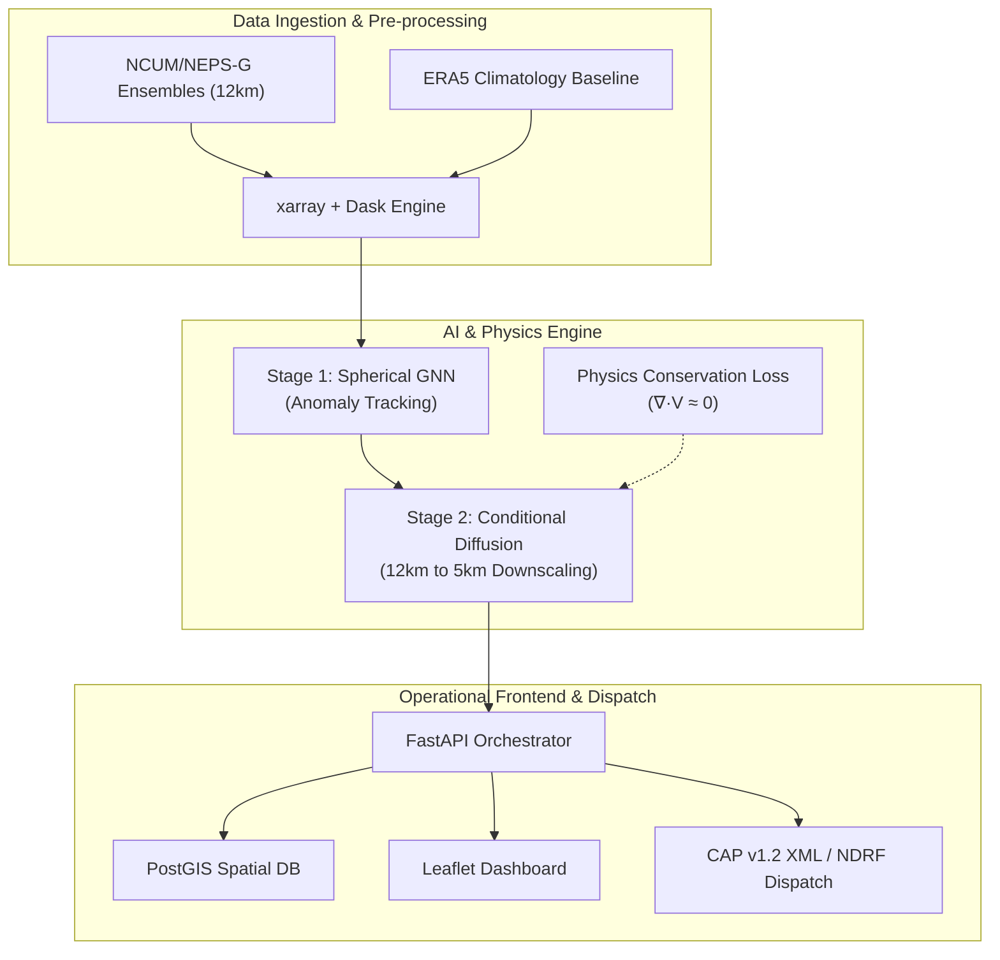

# AeroMesh-AI: Extreme Weather Tracking and Amplitude-Preserving Downscaling Engine

[](https://www.python.org/)
[](https://fastapi.tiangolo.com/)
[](https://pytorch.org/)
[](LICENSE)

**AeroMesh-AI** is a physics-informed, high-resolution extreme weather
tracking and downscaling framework designed for the Ministry of Earth
Sciences (MoES) and NCMRWF. It addresses the critical limitation of
traditional Numerical Weather Prediction (NWP) models---namely, spectral
smoothing and peak-amplitude degradation---by coupling **Spherical Graph
Neural Networks (GNNs)** with **Physics-Guided Conditional Diffusion
Models**.

------------------------------------------------------------------------

## 🌟 Key Features

-   **Spherical Mesh GNN (Stage 1):** Operates on an icosahedral
    geodesic grid to track global extreme anomalies ($Z \ge 2.5\sigma$)
    without high-latitude polar distortion.
-   **Amplitude-Preserving Diffusion (Stage 2):** Downscales 4D global
    ensembles from 12 km to 5 km resolution while embedding rigorous
    physical constraints ($\nabla \cdot \mathbf{v} \approx 0$) to
    eliminate physical hallucinations\[cite: 1\].
-   **Memory-Safe Ingestion:** Utilizes `xarray` and `Dask` parallel
    chunking to process massive NetCDF/GRIB2 ensembles securely under
    tight RAM limits (\< 2 GB)\[cite: 1\].
-   **Actionable Emergency Dispatch:** Integrates with a FastAPI
    backend, PostGIS spatial asset trackers, and generates automated
    Common Alerting Protocol (CAP v1.2) XML feeds and NDRF PDF incident
    briefs\[cite: 1\].

------------------------------------------------------------------------

## 🏗️ System Architecture



## 🛠️ Tech Stack

-   **Core Engine:** Python, PyTorch, PyTorch Geometric, xarray, Dask
-   **Backend:** FastAPI, Uvicorn, PostGIS, GeoPandas
-   **Frontend & Visualization:** React, Tailwind CSS, Mapbox /
    Leaflet.js
-   **Meteorological Formats:** NetCDF4, GRIB2, CAP v1.2 XML

## 🚀 Getting Started

### Prerequisites

-   Python 3.10 or higher
-   CUDA-compatible GPU (recommended for DDPM sampling)

### Installation

1.  **Clone the repository:**

    ``` bash
    git clone https://github.com/your-username/AeroMesh-AI.git
    cd AeroMesh-AI
    ```

2.  **Create a virtual environment and activate it:**

    ``` bash
    python -m venv venv
    source venv/bin/activate  # On Windows: venv\Scripts\activate
    ```

3.  **Install dependencies:**

    ``` bash
    pip install -r requirements.txt
    ```

4.  **Run the FastAPI server:**

    ``` bash
    uvicorn app.main:app --reload --host 0.0.0.0 --port 8000
    ```

## 📂 Project Structure

``` text
AeroMesh-AI/
├── app/
│   ├── api/             # FastAPI routers and endpoints
│   ├── core/            # Config and environment settings
│   ├── models/          # GNN & Conditional Diffusion architecture
│   └── utils/           # Dask streaming & spatial handlers
├── data/                # Sample NetCDF/GRIB2 configuration files
├── notebooks/           # Exploratory data analysis & prototyping
├── tests/               # Unit and integration test suites
├── Dockerfile           # Containerization configuration
├── requirements.txt     # Python package dependencies
└── README.md
```

## 📜 References & Research Foundation

-   Lam, R., et al. (2023). *Learning skillful global weather
    forecasting operations faster than NWP.* **Science**, 382(6674),
    1041-1046\[cite: 1\].
-   Pathak, J., et al. (2022). *FourCastNet: A global data-driven
    high-resolution weather forecasting model.* **arXiv preprint
    arXiv:2202.11214**\[cite: 1\].
-   Rischard, M., et al. (2023). *Conditional Denoising Diffusion
    Probabilistic Models for High-Resolution Precipitation Downscaling.*
    **Geophysical Research Letters**, 50(12)\[cite: 1\].

## 🛡️ License

This project is licensed under the terms of the [MIT
License](https://www.google.com/search?q=LICENSE).
